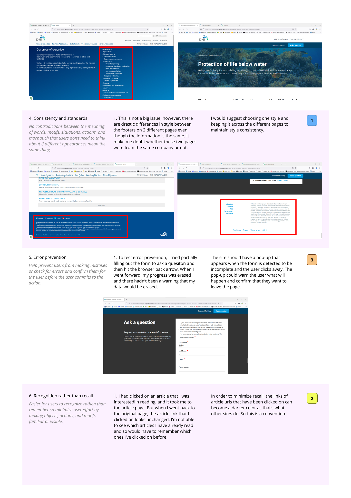
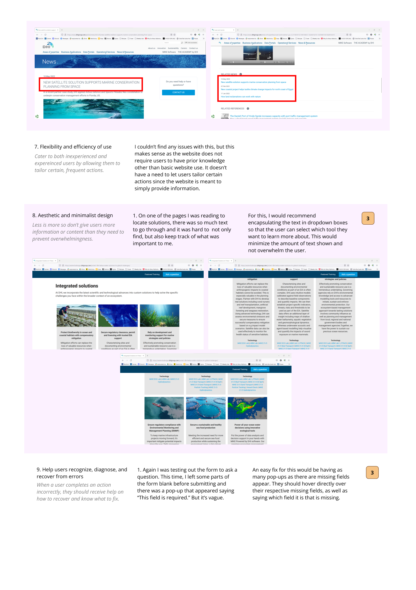

# Project: More Compelling Way for Young-Adults to Learn About Global Goal 14: Life Under the Sea and Act 

Belle Lerdworatawee | DGT HUM 110 | Fall 2022

### Design Challenge
Oceans are essential to the existence of humans as we rely on them for food, water, energy, and climate regulation. In spite of this, human activity causes severe damage towards oceanic ecosystems. For our survival, we need to take care of and protect our precious resources. However, before we can even begin to do that, it is important to catch people's attention and spark interest in caring for marine life and our oceans. Then, we can collectively make a difference in ways like controlling pollution and overfishing. Thus, my project aims to utilize design practices and user-research methods to create a user experience that educates and persuades young-adults to care for life under the sea. Young-adults are in an early stage of life where they have time and energy to act upon these issues. Additionally, they are the ones who will have to deal with the implications of a compromised ocean ecosystem as they choose to start families and make other serious life decisions so it's important to persuade them.

# Assignment 01: Heuristic Evaluation
### Case 1: [DHI Group](https://www.dhigroup.com)
This website is a company called DHI group who offers solutions for problems in water environments. They focus on research and applications to offer their clients the best ways to save water, share it, improve the quality, or manage its flow. I decided to look into this website as a potential source for solutions to marine life as that is an issue that they address.

### Case 2: [Marine Conservation Institute](https://marine-conservation.org)
The Marine Conservation Institute is an alliance that works to defend and advocate for marine ecosystems. They lead efforts to protect sea habitats and conserve coral ecosystems as well as marine animals. They prioritize protecting the ocean and offer many ways for people to join their mission, which is something that my project aims to do. Hence, this was why I decided to analyze this website. 

