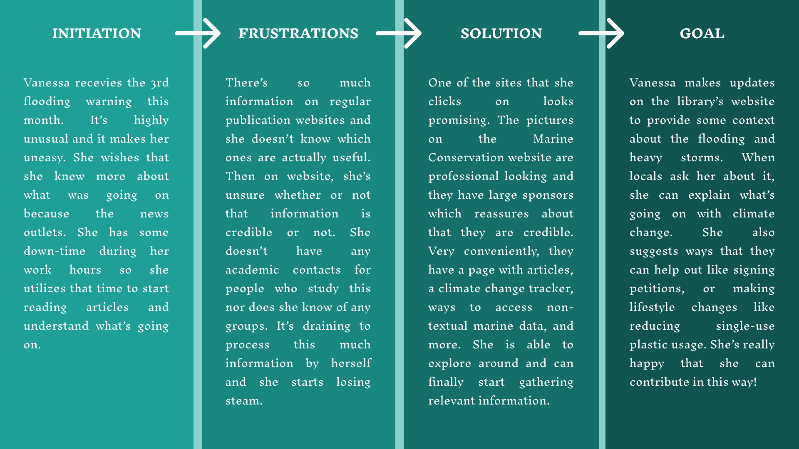

# Assignment 04: Persona + Scenario 

Belle Lerdworatawee | DGT HUM 110 | Fall 2022

## The Purpose of UX Storytelling 
My project is focused on helping young adults get out of their shell to find better ways to help with marine conservation. It’s crucial that I put myself into the shoes of the users to understand their perspective, struggles, and needs in order to best help them accomplish their goal. In order to reach as wide of an audience as possible, my product needs to take into consideration how the target user would like to use this website. Additionally, I’d like to go one step further and anticipate needs that the users might have in order to provide them the best experience possible. The process of creating personas helps me step into the shoes of a young adult as I’m not quite that age yet. Going through an empathy map allows me to consider how they might feel about a certain feature as well as obstacles preventing them from doing something that I might not have.

## Personas and Empathy Maps
### :one: Mickey Williams - _Overbooker_

### :two: Vanessa Wu - _Aspiring Activist_  

## Scenarios and Journey Maps
### :one: Feature 1 with Mickey: Embedding Instagram into the “Take Action” page
**Why is Mickey using this product?**
> Mickey leads a busy life working as a consultant at Amazon while trying to explore Seattle with his fiance and making new friends. He recently started trying to learn more about human impacts on the environment, specifically marine environments. This is because his fiance, who grew up around the beach, has been sharing a lot of her favorite spots with him. Amazon also offers a program that contributes to an organization of his choice for every 5 hours that he volunteers. Recently some of the beaches that his fiance loves are now closed due to toxic runoff. Devastated, Mickey was inspired to start doing some beach conservation work in order to reverse harmful human impacts. He wants to contribute to larger organizations so that he has more guidance and support, and can also make new friends that way.

**How is Mickey using this product?**
> After work, Mickey stays on his laptop perusing marine conservation organizations close in proximity to him. When he opens the website, there’s a header at the top that says “Take Action”. He clicks on that, which takes him to another page. On the page is a large picture that says “Take Action” complete with a quote below it. He then scrolls down and sees an embedded Instagram page which is picture-centric. Fascinated by the pictures, he keeps scrolling until he sees one that interests him enough to click on it. It’s a picture of a group of people protesting with signs. He reads the caption and learns about the group @highseasalliance. Mickey decides that it’s time to look for something to do, and clicks out of the post. This takes him back to the main page, and then he scrolls past the Instagram page which then reveals a button saying “Find local events near you!” This sounds like something that would be useful to him, so he clicks on it which takes him to another page. On this page, there’s a map that shows local sustainability events near his location in the form of location pinpoints. There’s also a sidebar that displays the details about the events such as time and location. He then clicks on a beach cleanup that’s closest to him, which reveals a link to that organization’s website and an RSVP form. Delighted to have found something, he asks his fiance if she wants to go with him to the event

**Mickey's Journey Map**

### :two: Feature 2 with Vanessa: Filters on the Publications page
**Why is Vanessa using this product?**
> Vanessa has always been active in taking a stance in her community to advocate for what she thinks is right and protecting the people she cares about. Throughout the years, she’s noticed that the weather is becoming increasingly unpredictable and the recent heavy storms and flooding led her to investigate why this is happening. After some initial research, she learns that the oceans play a large role in regulating storm weather but due to climate change, strange patterns are occurring. While she was saddened to learn that we can’t reverse the effects, she is hopeful that we can at least slow down the effects which would have a tremendous impact. Vanessa cares a lot about her home and the people around her, so she wants them to be safe. If there’s anything she can do no matter how small, then she will do it.

**How is Vanessa using this product?**
> Using her work computer, she stumbles across Marine Conservation from researching climate change papers on the Internet. The page allows her to filter by year and topic, as well as sort alphabetically. These appear as options on the left side of the page. She chooses the current year 2022. This already removes a lot of articles from the page, which helps Vanessa breathe a little easier as there’s less information to process. She chooses an article from the list that she likes to start annotating. From this she’s able to gather a lot of information on marine protected area frameworks. She’s then able to parse it on her own to be able to spread the work and talk to local residents about it.

**Vanessa's Journey Map**

## Reflection
This activity was a lot harder than I had initially thought it would be. It took a lot of energy and time for me to essentially come up with characters. I know now that my strong suit is not coming up with characters from scratch. Making the persona was fine because that was more listing the demographics and writing a story for them. However, the Empathy Map was particularly challenging because I needed to step into the shoes of my made-up person and think about what I would say with their personalities. The hard part was staying unbiased, and also creating coherent thoughts for them. I think this would be easier if I were able to have more talks with young adults to be able to understand common sentiments, struggles, and wants for this population.
