# Assignment 04: Persona + Scenario 

Belle Lerdworatawee | DGT HUM 110 | Fall 2022

## Overview

**Purpose:** 
> The purpose of creating and testing a low-fidelity prototype is to perform a preliminary analysis of whether or not the features that I ideated from user testing are functional or not. I am trying to determine whether or not they are helpful to the target user demographic.

**User Personas:**
> The personas that I created can be characterized as such: young adults with a career, in their mid-twenties to thirties, busy with other life commitments, not very aware of ocean sustainability, may not be close (proximity-wise) to organizations that host events. They have the desire to make a change, but may be beginners to this movement and need some extra help getting out of their shell to try new things or are finding ways to contribute no matter where they are. Thus they need a platform to find such information, and they do not need any specific level of expertise or tech-knowledge to use the application. 
>
> Please find more information about user personas and task scenarios [here](https://github.com/blerdwor/F22-DGT-HUM-110/blob/main/Assignment04.md).

**Features:**  
> Through various trials of user research, including usability testing on a marine conservation website, participatory research, and an interview with a member of the target demographic, I was inspired to create this low-fi prototype. It will provide two main features: a filter to allow the user to read up on current news about threats and solutions for protecting life below water as well as a location-matcher to enable them to find ways to join the effort. 

The low-fidelity prototype supports the following tasks:
* Find local events to get involved with
* Learn about ways to get involved without being physically present
* Read about current news on life below water
  * Filter the news by year
  * Filter the news by author
  * Filter the news by topic
* Search for specific current news

## [Wireframes](https://www.figma.com/file/nOk5ic4m1PlpO12fS6Q99V/Lofi-Prototype-Demo?node-id=0%3A1)

Landing Page

  <kbd>
    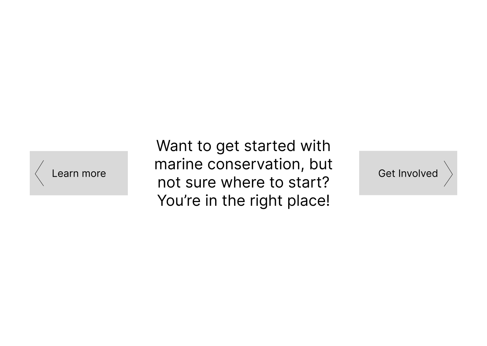
  </kbd>

Local Events

  <kbd>
    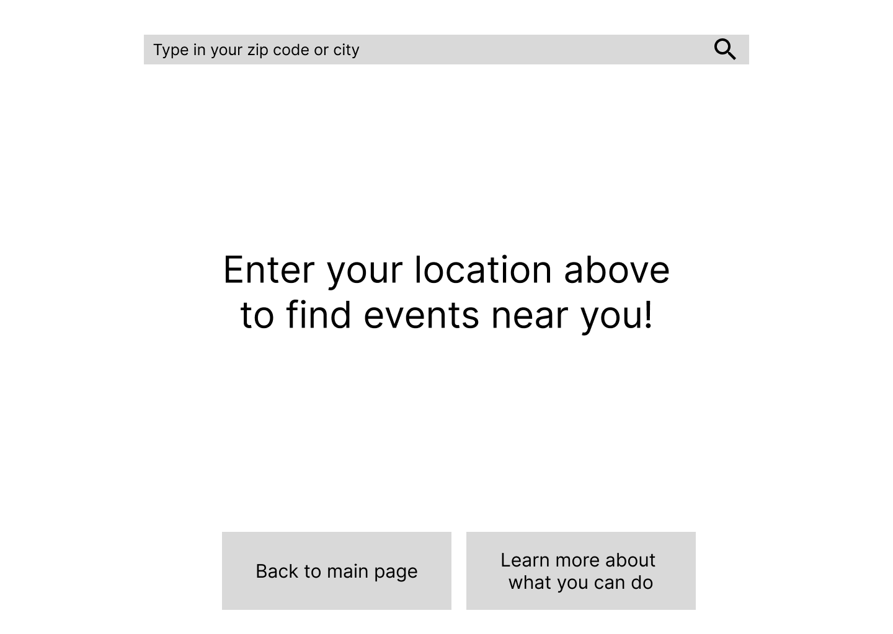
    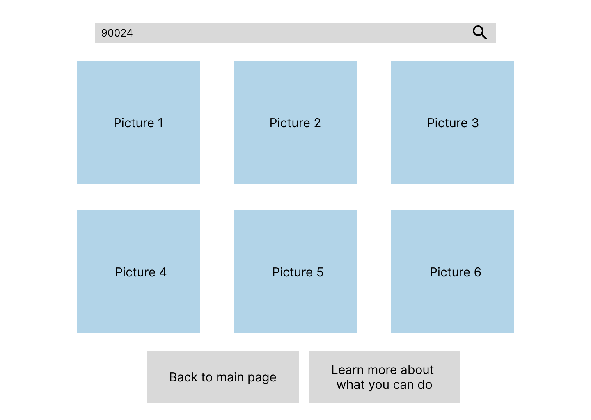
  </kbd>

  <kbd>
    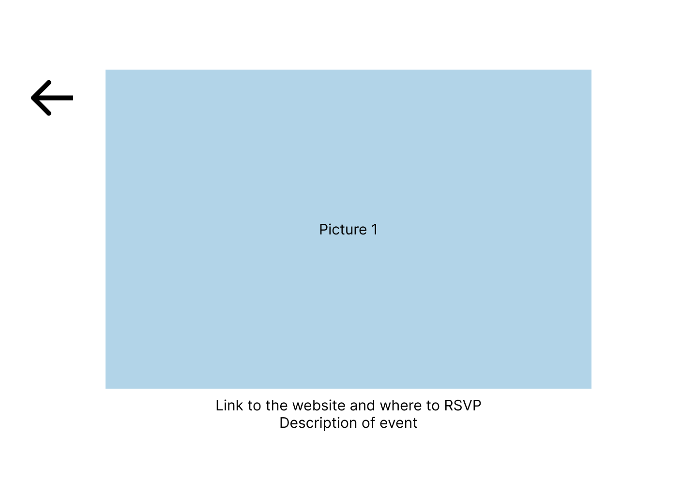
    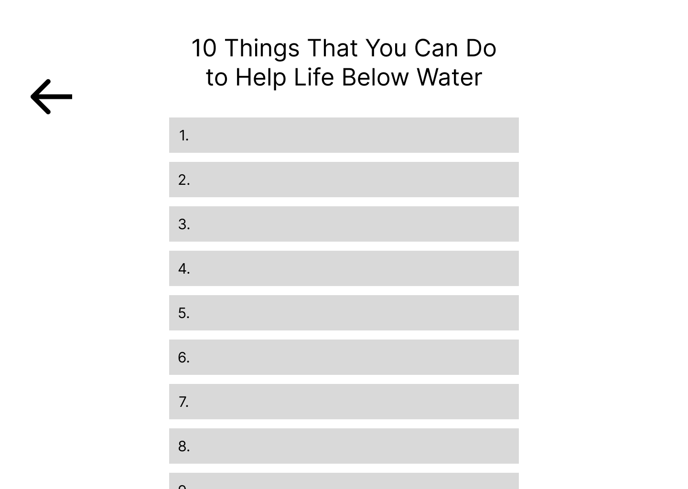
  </kbd>

Current News

  <kbd>
    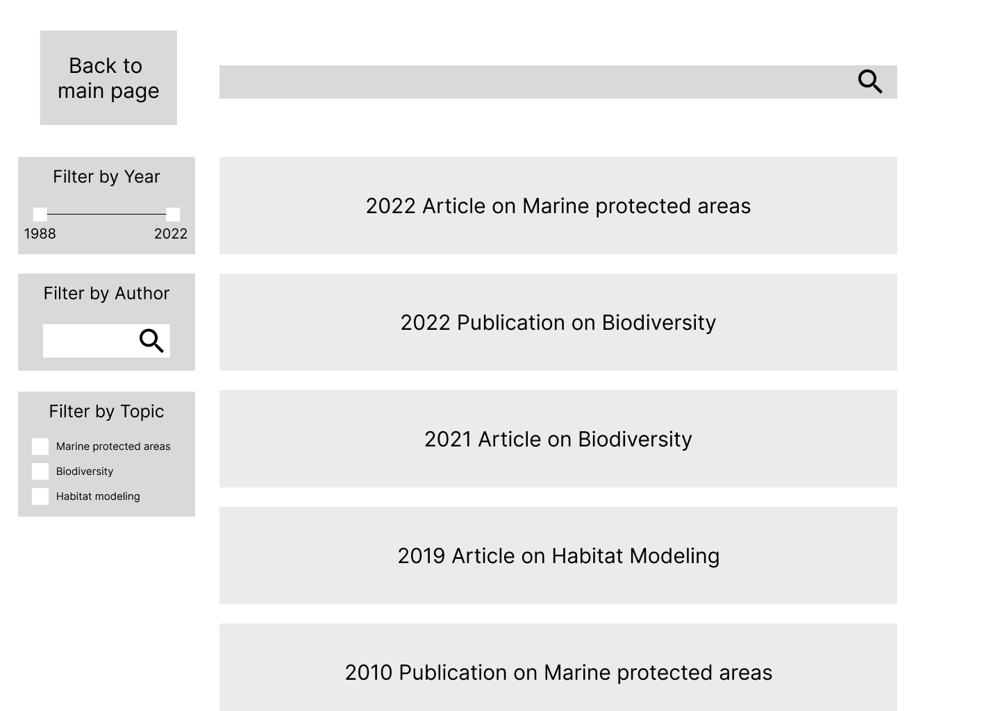
    
  </kbd>

  <kbd>
    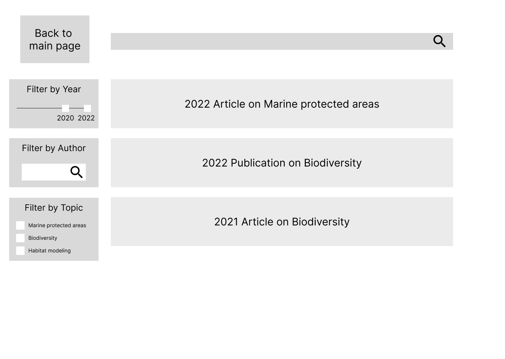
    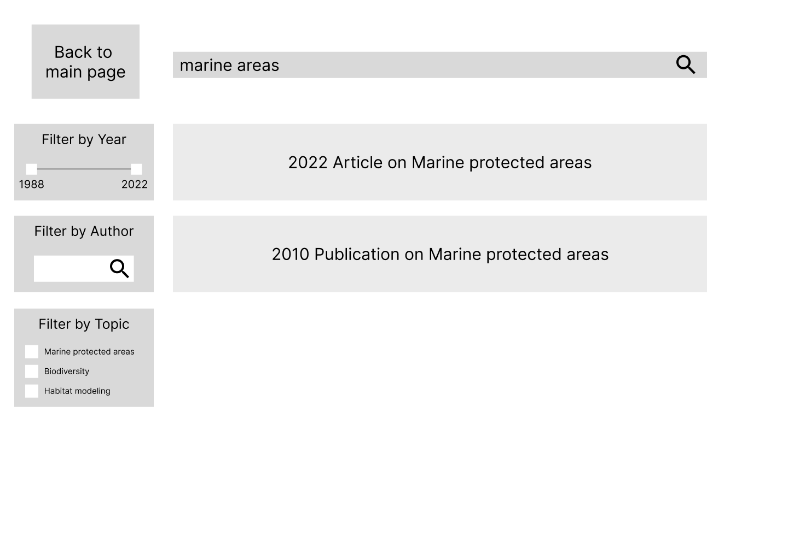
  </kbd>

## Wireflow

  <kbd>
    
  </kbd>

Every user starts out at the landing page which offers two options: read current news or join a cause. If the user decides to learn more, they can click on the left button which will take them to another page. On that page is a list of relevant articles, a search bar on the top, and a filter bar on the left. The filter bar allows the user to look up an author that they’re interested in or want to read more publications by, choose a period for which articles were published during, and finally use checkboxes to choose multiple topics that they are interested in. If the user decides that they want to find events to join or learn about ways to get involved, then they can click on the right button which will also take them to a new page. This page first asks them to type in your location so that it can find events near them. After typing in the address, it displays the events as photos on the screen. There’s also a button below that if they aren’t near any events, then the user can click on that to learn about different ways besides volunteering to help out. Every blue arrow represents a way to return to the original menu.
  
## User Testing of Lo-fi Prototype

I asked one of my friends who is pursuing a masters degree to help me test out the lo-fi prototypes. They would be considered as in the early stages of a young adult.

### Filter articles by year :heavy_check_mark:
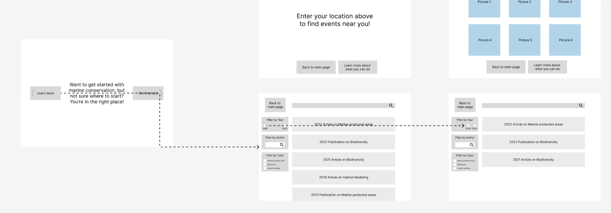
This task was fairly simple but I think that there was some difficulty in learning how to use Figma as opposed to actually figuring out which pieces connected to each other. While observing them, I also needed to intervene and explain that they should go through the entire process starting from the landing page. Otherwise, they were starting at the page with the filter box showing. Then I also clarified and asked them to be as specific as possible when selecting which buttons go to which frames or objects. Before that, they were linking one button to just one frame and then that was the end of it. However, after explaining, they got it pretty quickly and could complete the whole flow.

### Filter articles by topic :heavy_check_mark:
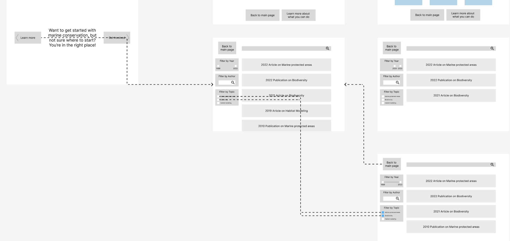 
They completed this task pretty quickly as well. I think that after the first round, my friend knew what to do. They were able to read each button very quickly and intuitively decide which path to go. This told me that not bombarding the user with information is effective and allows them to more easily navigate. 

### Find an event to volunteer at :x:
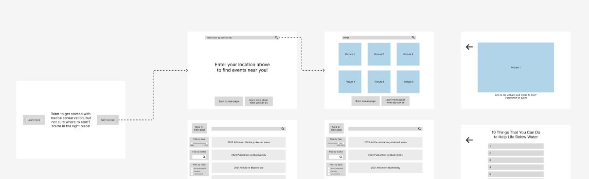
My friend was able to get to the “Local Events” page pretty quickly, but then they got stuck on how to get from the options page to choosing one of the events. I noticed that they carefully inspected everything that in their mind was “clickable” which did not include the picture itself. This was very good for me to know because that’s a very big error.

### Find other ways besides volunteering to help out :heavy_check_mark:
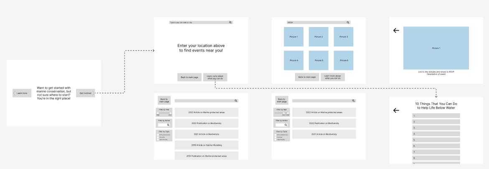
This one was also a simple task to finish. From the previous tasks, it seemed like they remembered which buttons went to which pages. That’s also good for me to know because if I can make the user interact with the system less, then there will be less for them to learn and have to memorize what to do. 

The user successfully completed **3 out of the 4** tasks above.

## Reflection + Revision

I thought it was very interesting to be building off of an existing system rather than creating something from scratch. I really enjoyed this process because it felt like puzzle-building, where I took the learnings from my research and applied it to what I had initially found confusing about the original website. During this process, I learned that even a low-fidelity prototype still needs to be very thorough and I ended with many more frames than I had initially expected. I thought that I would just need three to four frames but then I realized that each step needs to be its own frame. So, I ended up with about double my initial expected amount because I had so many different aspects to capture. I am definitely happy that I digitized the frames because it made it so much easier for the user to draw the arrows or undo mistakes, as well as allowed me to copy and paste the template for them to try new tasks. I also think that the interface was simple enough to allow the user to focus on the wireflow part because they completed most tasks very quickly without much guidance, if any. However, I learned something very glaring: it is not evident that the photos on the “Local Events” path are buttons that tell you more about the event. This taught me that a lo-fi prototype is at the end of the day, a low-fidelity prototype and there are many details that it can’t capture. I think that if I could show the pictures changing upon mouse hover, then that would have been more obvious. However, for the prototype the best fix I could think of was adding a plus-sign symbol to the corner to signify that this is a “clickable” item. This testing highlighted the importance of simplicity for me and to try to make things as intuitive as posible rather than creating new things that people do not understand.

Revised Version

  <kbd>
    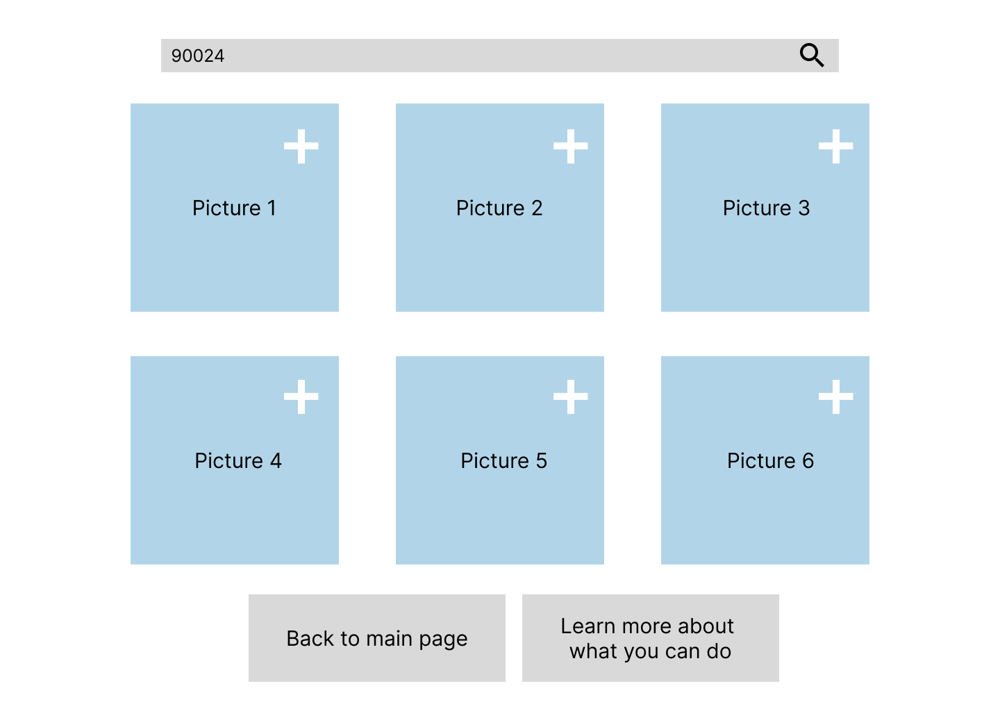
  </kbd>

