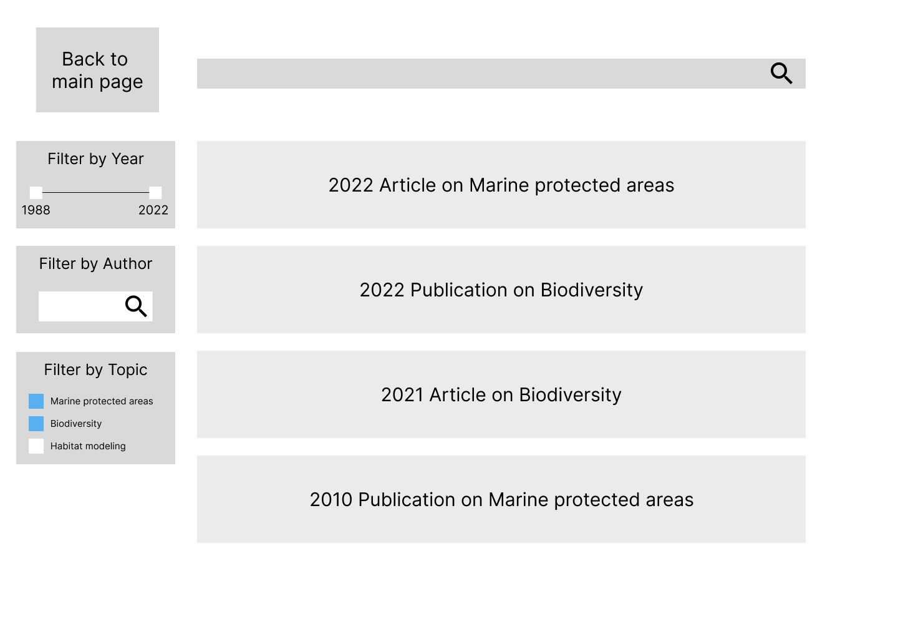

# Assignment 04: Persona + Scenario 

Belle Lerdworatawee | DGT HUM 110 | Fall 2022

## Overview

**Purpose:** 
> The purpose of creating and testing a low-fidelity prototype is to perform a preliminary analysis of whether or not the features that I ideated from user testing are functional or not. I am trying to determine whether or not they are helpful to the target user demographic.

**User Personas:**
> The personas that I created can be characterized as such: young adults with a career, in their mid-twenties to thirties, busy with other life commitments, not very aware of ocean sustainability, may not be close (proximity-wise) to organizations that host events. They have the desire to make a change, but may be beginners to this movement and need some extra help getting out of their shell to try new things or are finding ways to contribute no matter where they are. Thus they need a platform to find such information, and they do not need any specific level of expertise or tech-knowledge to use the application. 

**Features:**  
> Through various trials of user research, including usability testing on a marine conservation website, participatory research, and an interview with a member of the target demographic, I was inspired to create this low-fi prototype. It will provide two main features: a filter to allow the user to read up on current news about threats and solutions for protecting life below water as well as a location-matcher to enable them to find ways to join the effort. 

For more information about user personas and task scenarios, please read about it [here](https://github.com/blerdwor/F22-DGT-HUM-110/blob/main/Assignment04.md).

## Wireframes

Landing Page

  <kbd>
    
  </kbd>

Local Events

  <kbd>
    
    
  </kbd>

  <kbd>
    
    
  </kbd>

Current News

  <kbd>
    
    
  </kbd>

  <kbd>
    
    
  </kbd>

## Wireflow

  <kbd>
    
  </kbd>

  
## User Testing of Lo-fi Prototype

### Filter articles by year :heavy_check_mark:

### Filter articles by topic :heavy_check_mark:

### Find an event to volunteer at :x:

### Find other ways besides volunteering to help out :heavy_check_mark:

## Reflection + Revision
