# Assignment 06: Interface Design 

Belle Lerdworatawee | DGT HUM 110 | Fall 2022

## Overview

**Project:** 
> The purpose of this project is to help young adults learn about ocean sustainability and find ways that they can help protect marine life. From conducting interviews and field research, I learned that a sample of young adults in LA feel that climate change can be overwhelming, don’t think that helping out is convenient, and like social aspects. Hence, my design aims to address these concerns by providing a website that makes ocean sustainability seem welcoming and worthwhile. The key tasks that this supports are:
> 1. able to easily find relevant information on news about life below water
> 2. able to easily find ways to help out both in-person and remotely

**Purpose of Interface Design:**
> This design is intended to establish a design library for the project, establish a visual template and basic interactions, and to serve as a platform for impression testing. It’s another part of the process of conducting user research in that this is a tangible representation of a UI designer’s ideas that they can check against users using the impression test, and then go back and revise.

**Process:**  
> I used Figma to create the Interface Design. I had digitized the frames in the last project, and so I chose one of the wireframes to focus on. I started with a grid to conduct the layout test, and adjust the components accordingly. Then I moved onto typography; I looked through Google fonts to see which fonts matched the energy that I wanted to convey from the website and then played around with different pairings. Next, I developed the color scheme for both light and dark using oceanic colors. I also included colors for the states of interaction like hovering over the button. Lastly, I showed the iterations of this process in the Figma but I also wrote a summary at the bottom of the page as well as added my choices as styles in the Figma.
 
The Figma design file can be found [here](https://www.figma.com/file/nOk5ic4m1PlpO12fS6Q99V/Lofi-Prototype-Demo?node-id=33%3A124).

The Figma full screen design (for impression testing) can be found [here](https://www.figma.com/proto/nOk5ic4m1PlpO12fS6Q99V/Lofi-Prototype-Demo?node-id=66%3A601&scaling=scale-down&page-id=66%3A139).

## Screen Design
> This is the original wireframe from last week's activity. 
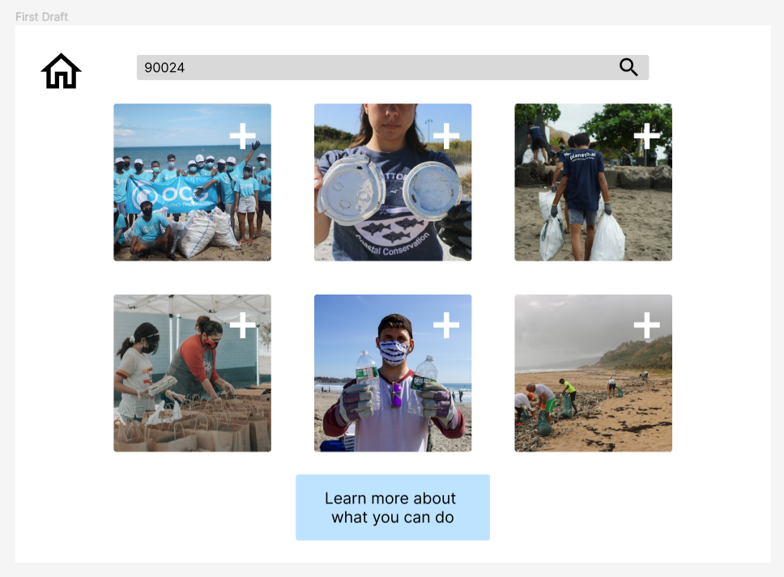

### Layout Test
> It was very clear that I needed 3 (or a multiple of 3) columns since I wanted to simulate an Instagram-looking grid. That meant that I needed to have wider horizontal margins. For the rows, I wanted to split the screen into more or less 3 parts, not necessarily equal. The first part should consist of the title and search bar, then the middle is the image grid, and then bottom is the button. I played around with multiple rows until I found the layout that had the best division, and more or less made the split even.  

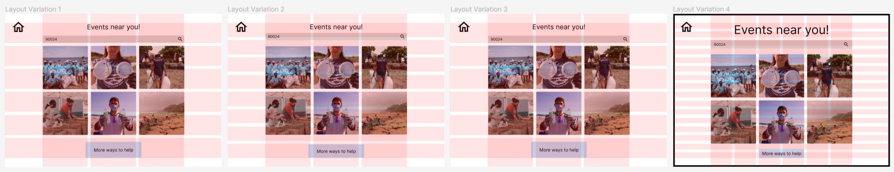

### Three Typography Variations
> From user research, I learned that young adults are looking for events that seem fun, fresh, and friendly. Hence, I looked for fonts that are handwritten to seem more personal and down-to-earth, and also adds an aesthetic layer. The other fonts, however, are regular to afford legibility. I looked in the list of Sans Serif fonts as those are rounder, bubbly-looking, and friendlier than serifs which are more formal. I combed through Google Fonts to find some that I thought looked good, and then played around with the combination of fonts. The screens display the iterations that I tried out. I settled on the fonts Reenie Beenie and Quicksand; I spaced out the Reenie Beenie to make it easier to read and used Quicksand for everything else.

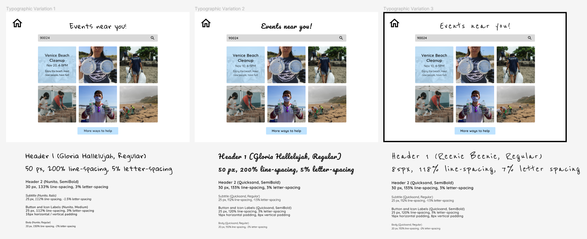

### Three Shape Variations
> Again going with the theme of fun and friendly, I opted for rounded corners but I needed to play around with how much roundness would look good. The initial draft had all the same roundnesses which still seemed very boxy and rigid. Next, I went in the opposite direction and made everything more or less circular. However, this produced a lot of white space in my opinion which was slightly jarring from a visual perspective. From these two drafts, I then combined what I liked best about both of them⁠—the rounded search bar but more square images and button. I chose it to also further create an “imaginary” divide. In order to create an impression of a header and the page without adding clutter like lines or a divide, the home button and search bar are completely round to create the effect that they belong to the same group, namely the header. Then the bottom image grid and button are both squares with the same corner roundness so that the user subconsciously groups them together. Lastly, the square images help create more of a grouped image grid due to their proximity and uniform spacing. 

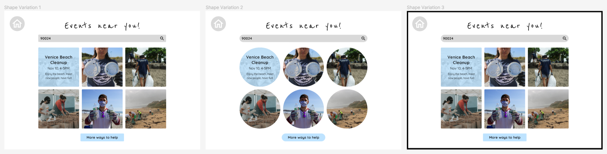

### Two Color Schemes and Accessibility Check
> While creating the color scheme, I ran into many issues with color contrast. Initially I uploaded a photo from the Marine Conservation’s website (the one I analyzed) to Adobe’s color theme picker. 

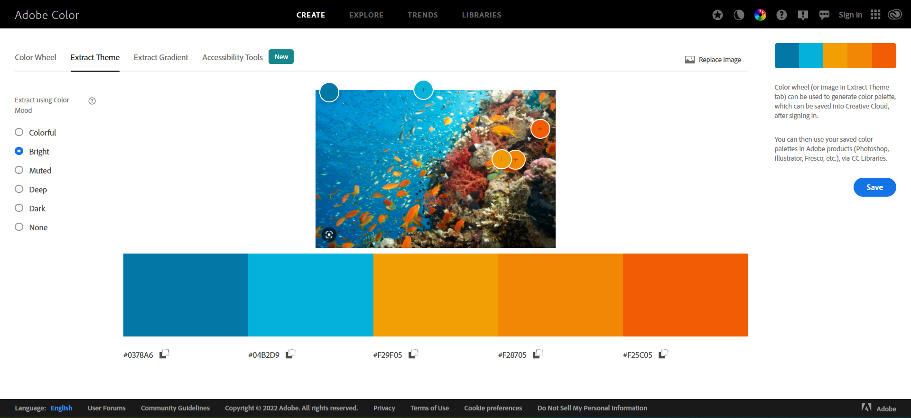 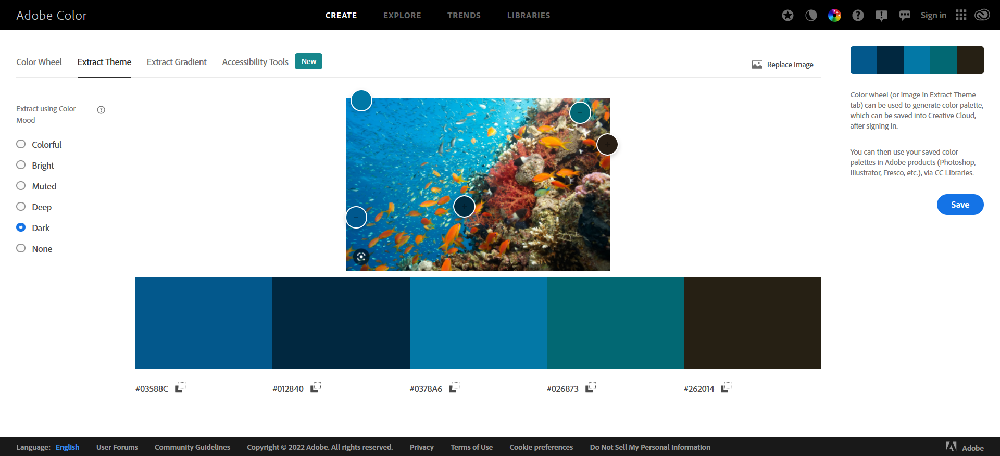

> I liked the Bright and Dark theme that they had so I tried to use those first, but none worked well for the background color. From there, I decided to go with a tan color to be reminiscent of sand and then add in brighter colors like green, orange, and blue to evoke seaweed, fish, and the water. The problem was that none of the combinations I chose had stark enough contrast; so I found an accessible color palette builder and instead I worked off of there. Then I was able to pair colors that work well together while still passing the color checker. Similarly the process was the same for dark mode, however instead of fish and the water, the inspiration was seaweed, turtles, and the water. 

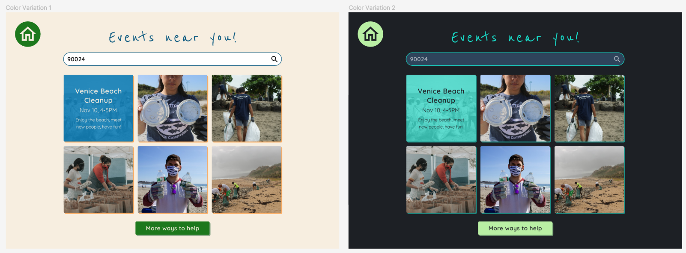

### Accessibility Test
> The color tests here show the contrast between:
> 1. background color and text
> 2. background color and button color
> 3. button color and text (The text is the same color as the background so the ratio is the same as above; this was intentional to make the words seem "cut-out" of the button.)   

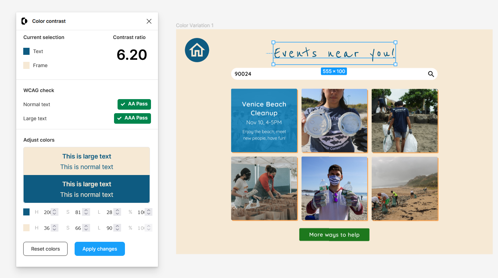 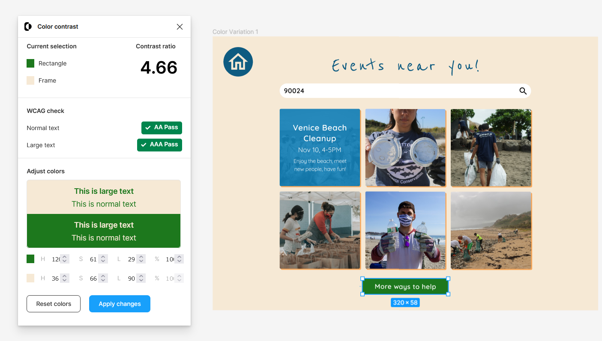

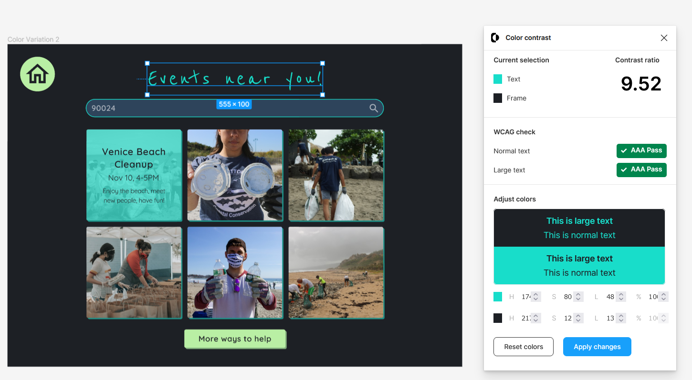 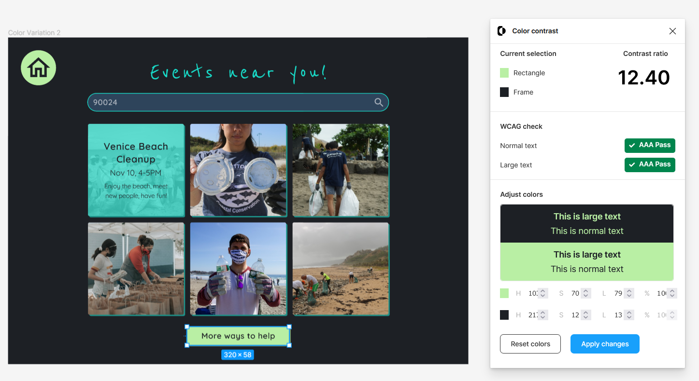 

> The errors shown from the A11y plugin in both of the light and dark screens are not applicable. It's comparing the font in the image to the background. It's flagged as an error because the text and the background are the same color, producing a ratio of 1. However that text is not on top of the background, but the plugin just doesn't recognize that.  

### Design System
> Below is a summary of the design system. This is also documented in Figma. 

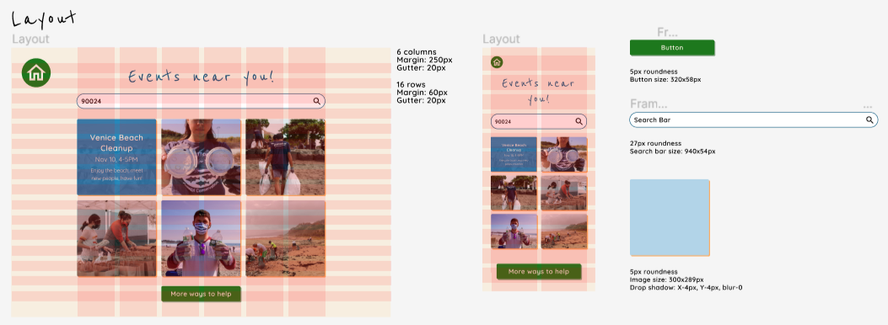
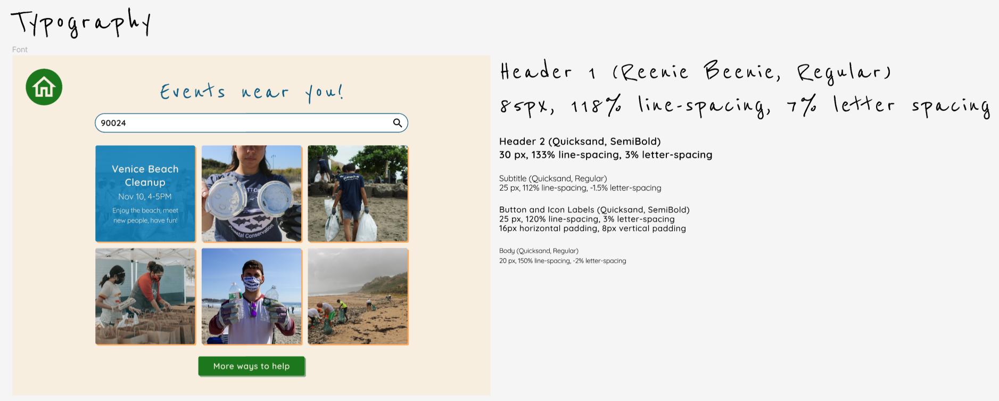
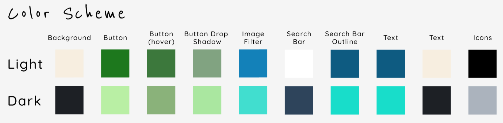

## Impression Test
I asked my two roommates to conduct an impression test for me. I showed them the full screen version of the prototype and gave them 5 seconds to look at it. Then I asked them to describe their initial impression, what they thought the website was for, if they thought it was reliable / professional, and overall opinion of it. These were their responses below:

>"The layout is super simple so there wasn’t a lot to process which was good since I only had 5 seconds to scan the page. Based on the pictures, it seems like it’s for a beach related event…? But other than that, I’m not very sure. I like the look of it! It’s really cute and I like the font; it’s fun. I think it looks professional too because of how clean and uniform the design is."

>“The first thing I remember is the image grid in the middle. That really stuck out to me and I like that the page is image-centered rather than text. But now I’m not super sure what the website is for. I know the title above said something like “Events near you” but that’s not very clear to me what events. I think the page is nice-looking too, although it might be a little plain but that’s just my opinion. It definitely looks professional to me!

**Findings:** It seems like the website does well to look professional due to its lack of clutter, and uniform shapes and colors. The biggest problem that I am running into is recognizability. While they can infer that this is a site relating to the ocean, it is not immediately obvious what specifically the site does. This is a functional problem. Based on this test though, I did find success in making the webpage look friendly and inviting!  

## Reflection
This process was a lot more time-intensive than I had expected. I spent much longer on the layout than I had originally anticipated. I think that with time and experience, I’d have a better idea of what proportions look aesthetically pleasing. I also spent a long time experimenting with the font types, sizes, and arrangement which is to be expected. Similarly, color is also difficult to get right on top of the added challenge of ensuring that the design is visually accessible. I’m really grateful for the Figma plugins and web tools that helped me develop a usable color palette. This activity gave me a lot of insight on what it’s like to be a UI designer and naturally, coming up with something from scratch demands a lot of time and effort. The documentation for UI is written exceptionally well, which was helpful. Something that I wasn’t able to do was test the readability of the font. I think the Quicksand font is fine, but I have doubts about the Reenie Beenie title. So far, the two people who I had asked to conduct the impression test for me did not notice or comment about the legibility of the font. I’m not sure how a wider audience would perceive it. 
