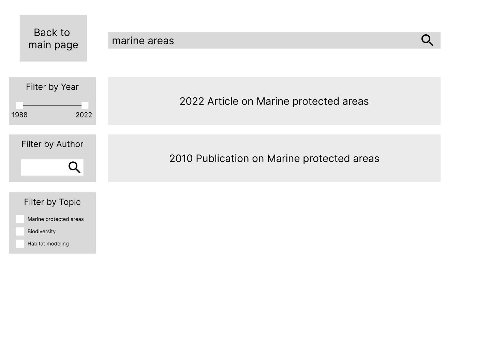
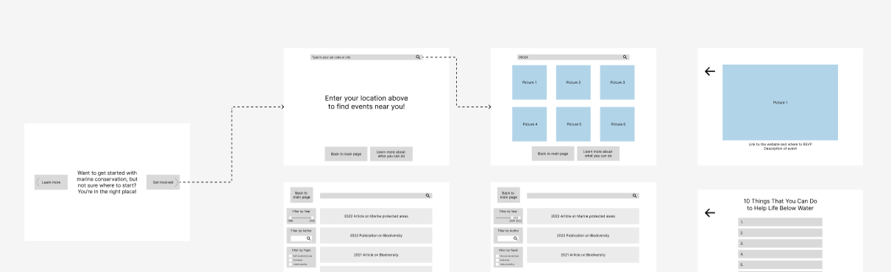

# Assignment 06: Interface Design 

Belle Lerdworatawee | DGT HUM 110 | Fall 2022

## Overview

**Project:** 
> The purpose of this project is to help young adults learn about ocean sustainability and find ways that they can help protect marine life. From conducting interviews and field research, I learned that a sample of young adults in LA feel that climate change can be overwhelming, don’t think that helping out is convenient, and like social aspects. Hence, my design aims to address these concerns by providing a website that makes ocean sustainability seem welcoming and worthwhile. The key tasks that this supports are:
> 1. able to easily find relevant information on news about life below water
> 2. able to easily find ways to help out both in-person and remotely

**Purpose of Interface Design:**
> This design is intended to establish a design library for the project, establish a visual template and basic interactions, and to serve as a platform for impression testing. It’s another part of the process of conducting user research in that this is a tangible representation of a UI designer’s ideas that they can check against users using the impression test, and then go back and revise.

**Process:**  
> I used Figma to create the Interface Design. I had digitized the frames in the last project, and so I chose one of the wireframes to focus on. I started with a grid to conduct the layout test, and adjust the components accordingly. Then I moved onto typography; I looked through Google fonts to see which fonts matched the energy that I wanted to convey from the website and then played around with different pairings. Next, I developed the color scheme for both light and dark using oceanic colors. I also included colors for the states of interaction like hovering over the button. Lastly, I showed the iterations of this process in the Figma but I also wrote a summary at the bottom of the page as well as added my choices as styles in the Figma.
 
The Figma design file can be found [here](https://www.figma.com/file/nOk5ic4m1PlpO12fS6Q99V/Lofi-Prototype-Demo?node-id=33%3A124).
The Figma full screen design (for impression testing) can be found [here](https://www.figma.com/proto/nOk5ic4m1PlpO12fS6Q99V/Lofi-Prototype-Demo?node-id=66%3A601&scaling=scale-down&page-id=66%3A139).

## Screen Design

### Layout Test
### Three Typographic Variations
### Three Shape Variations
### Two Color Schemes and Accessibility Check
### Design System

## Impression Test

## Reflection

Landing Page

  <kbd>
    
  </kbd>

Local Events

  <kbd>
    
    
  </kbd>

  <kbd>
    
    
  </kbd>

Current News

  <kbd>
    
    
  </kbd>

  <kbd>
    
    
  </kbd>

## Wireflow

  <kbd>
    
  </kbd>

### Task 3: Find an event to volunteer at :x:

My friend was able to get to the “Local Events” page pretty quickly, but then they got stuck on how to get from the options page to choosing one of the events. I noticed that they carefully inspected everything that in their mind was “clickable” which did not include the picture itself. This was very good for me to know because that’s a very big error.
