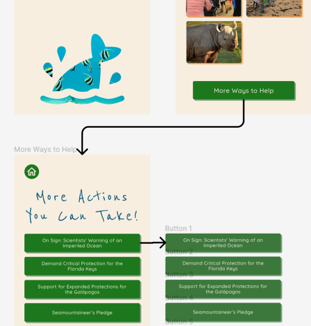

# Assignment 07: High Fidelity Prototype

Belle Lerdworatawee | DGT HUM 110 | Fall 2022

## Overview
**Project:** 
> The purpose of this project is to help young adults learn about ocean sustainability and find ways that they can help protect marine life. From conducting interviews and field research, I learned that a sample of young adults in LA feel that climate change can be overwhelming, don’t think that helping out is convenient, and like social aspects. Hence, my design aims to address these concerns by providing an app that makes ocean sustainability welcoming and worthwhile. The key tasks that this supports are:
> 1. able to easily find relevant non-textual information on news on topics relating to marine conservation
> 2. able to easily find relevant textual information on news on topics relating to marine conservation
> 3. able to easily find ways to help out both in-person and remotely

**Purpose of Interface Design:**
> The purpose of making this high-fidelity prototype is to allow users to visualize  features that I wanted to add to the Marine Conservation’s webpage in order to improve it. This prototype allows us to conduct primitive usability tests.

**Process:**  
> This prototype started with observations and ideas from user testing. Firstly, the design decisions were chosen from observed desires or problems expressed by young adults during field research and interviews. Afterwards, I created 2 user personas to map out the interactions that I wanted to create and what problems they would solve specifically. Then I made a low-fidelity prototype as well as the design kit for it. I tested both with other users to gain a general impression of if the flow made sense or not, and how aesthetic / accessible was my design. I had initially started with a web app; however I changed it to a mobile app. Hence, I needed to modify my low-fidelity prototype a bit and the design library. With this, I started building the frames for my high-fidelity prototype in Figma. Throughout the process and with feedback that I received, I changed one of the original tasks that I had planned as well as conducted research on what content I included in the prototype.
>
> I plan to conduct a cognitive walkthrough as well as continue to ask for feedback from users to be able to revise my app as best as possible. 

## Wireflows
Please note that these are simplified versions of the wireflow! I only included one example of each interaction to make the diagram simpler as many interactions are repeats. I included all unique types of interactions that users may have with the app. The diagram was too complicated and messy with every interaction mapped out since they were essentially the exact same flows.

:one: This is how the app starts off. You choose whether you want to learn about ocean conservation or if you want to dive right in and help out.

:two: If you choose to dive right in finding events, then you would be able to type in your zip code or city to search for local events. I wasn't able to simulate typing in Figma so on the prototype demonstration below, the search bar will automatically be filled with Westwood's zip code when you click on it. That then leads to a grid full of options for helping out. Hovering over an image will provide you with more information; clicking on the image will pull up an overlay with a url and a description of the event.

:three: Every "More Ways to Help" button leads to the same page. On this page, you can hover over each button to click on a link to an external petition or resource.

:four: If you choose to learn more about efforts in ocean conservation, it will show you 4 options. One of the options is just learning about statistics on pollution in the oceans. 

:five: Another option is exploring the mammal sound database. On here, you can click play and pause on each mammal to hear what they sound like. I don't think there's a way to embed sound on Figma currently, so the demonstration only shows the progress bar. 

:six: Thirdly, the app allows you to read up on current articles if you are more of a textual person. The user can choose from articles shown on the main screen which then brings up the article. The user can exit using the back arrow.

:seven: Lastly, something that the user can learn about is tracking current coastal clean-up efforts. They can select different machines on the screen to see where it is deployed and what that machine is doing. Some of the popups have linked videos that when clicked on will open a new tab with the video.

:eight: Every home button will take the user back to the home screen.

## Prototype
[Design File](https://www.figma.com/file/nOk5ic4m1PlpO12fS6Q99V/Prototype-Demo?node-id=86%3A124&t=zl0kpMz17ORfKtEF-1)

[Wireframe](https://www.figma.com/file/nOk5ic4m1PlpO12fS6Q99V/Prototype-Demo?node-id=205%3A480&t=zl0kpMz17ORfKtEF-0)

[Complete Prototype](https://www.figma.com/proto/nOk5ic4m1PlpO12fS6Q99V/Prototype-Demo?node-id=86%3A124&scaling=scale-down&page-id=86%3A124&starting-point-node-id=86%3A862)

[Prototype Restricted to Task 1 & 2](https://www.figma.com/proto/nOk5ic4m1PlpO12fS6Q99V/Prototype-Demo?node-id=205%3A1303&scaling=scale-down&page-id=205%3A1238&starting-point-node-id=205%3A1303)

[Prototype Restricted to Task 3](https://www.figma.com/proto/nOk5ic4m1PlpO12fS6Q99V/Prototype-Demo?node-id=205%3A1996&scaling=scale-down&page-id=205%3A1996&starting-point-node-id=205%3A2061)

## Cognitive Walkthrough
In progress.

## Sources
> I took pictures and information on tracking pollution for the frame “Track cleanup efforts” here: https://theoceancleanup.com/dashboard/# 
> 
> I used the images and mammal names for the frame “Sound database” from here: https://cis.whoi.edu/science/B/whalesounds/index.cfm 
>
> I used the statistics for the frame “Statistics” from here: https://oceanliteracy.unesco.org/plastic-pollution-ocean/ 
>
> I used the articles and images linked below for the frame “Current Events” from here:
>
> https://www.conservation.org/blog/news-spotlight-a-sea-turtle-sanctuary-has-thrived-for-40-years.-climate-change-could-change-that 
> 
> https://www.unep.org/news-and-stories/story/why-nature-holds-key-meeting-climate-goals 
> 
> https://abcnews.go.com/International/higher-surface-temperatures-detectable-pacific-ocean-decades-earlier/story?id=93244915 
