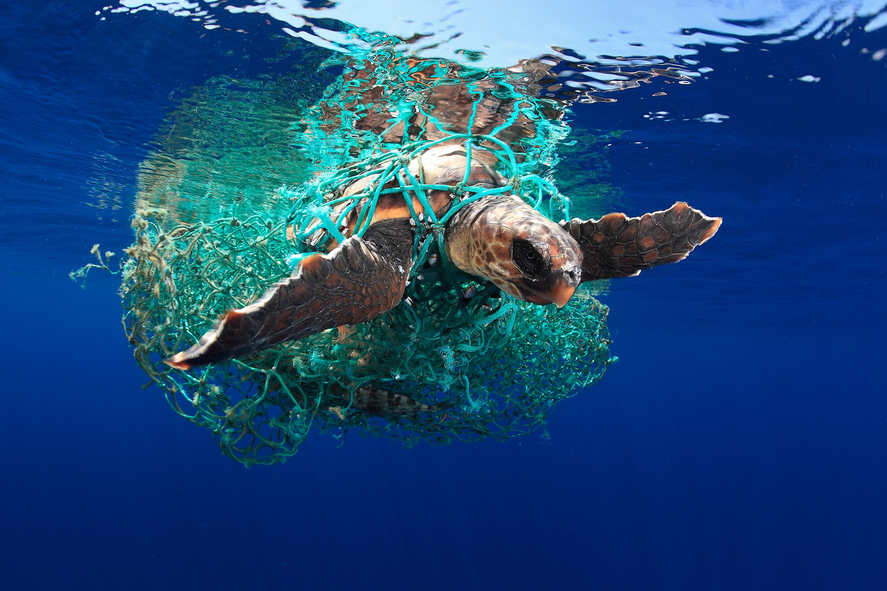
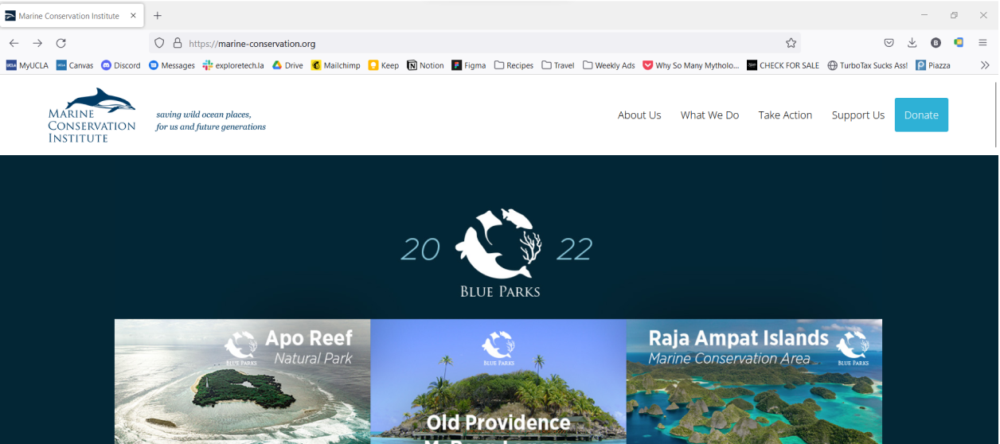
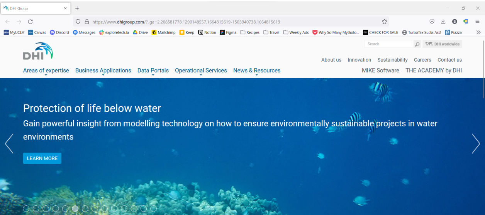
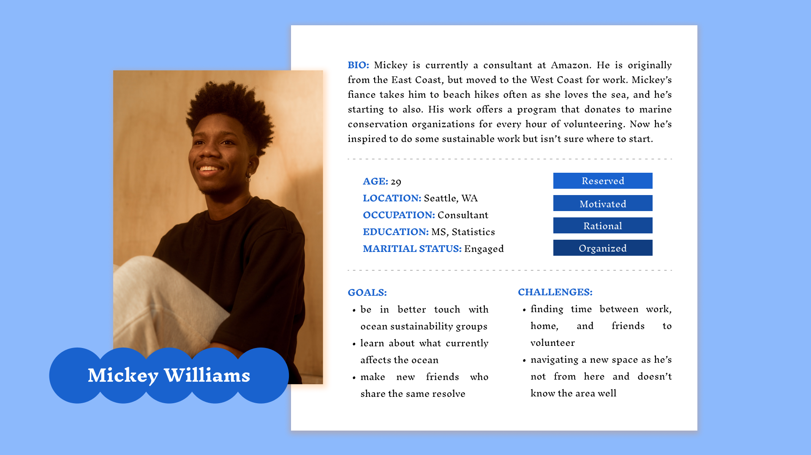
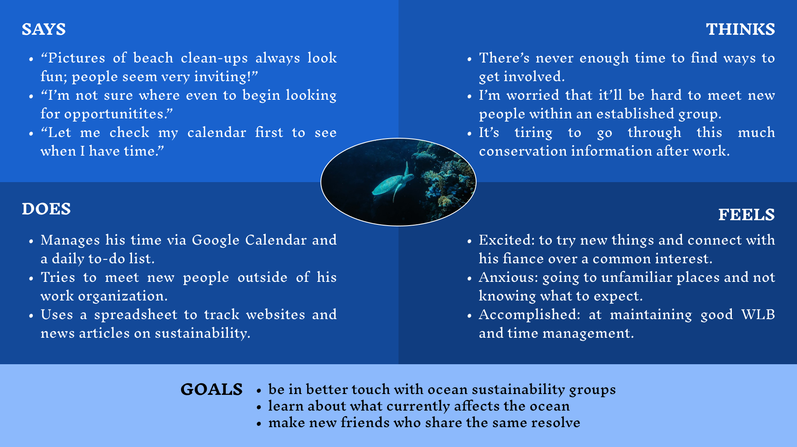
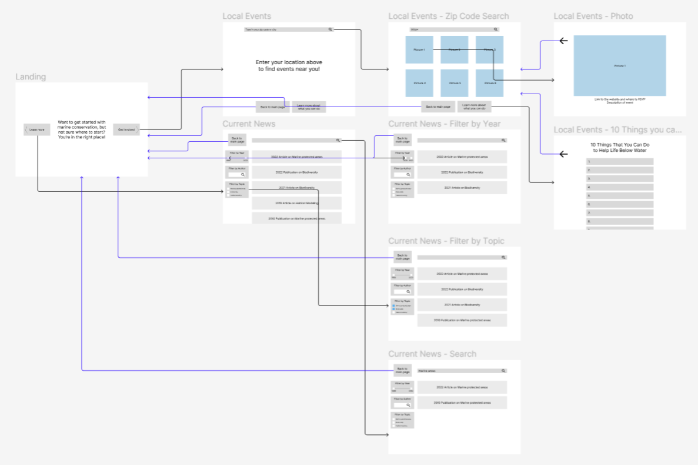
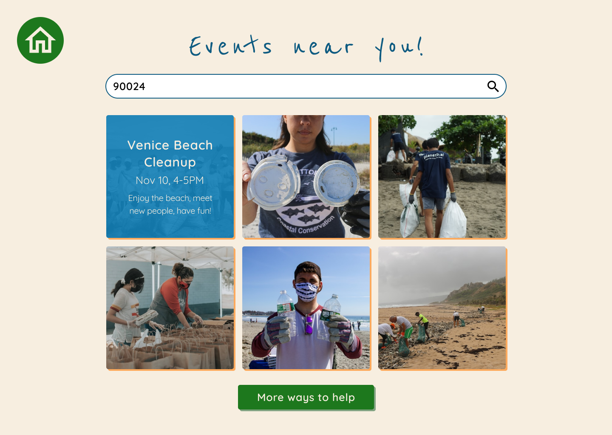
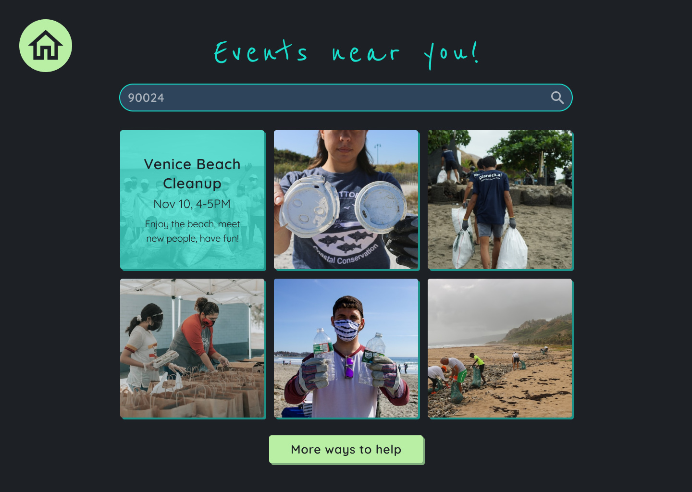
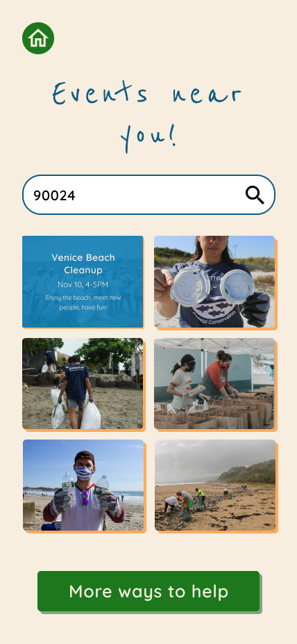
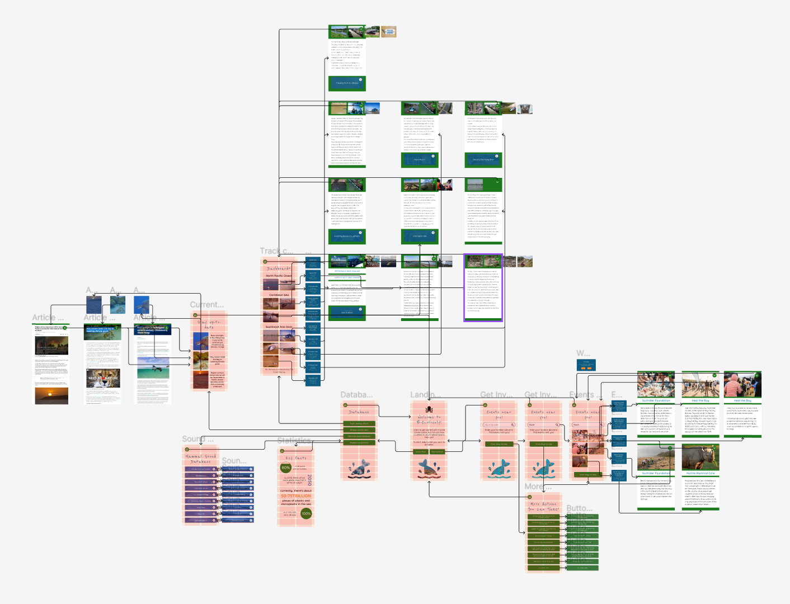

# Making Marine Conservation Fun and Simple!

## Belle Lerdworatawee | DGT HUM 110: UI+UX Design | Fall 2022

## Table of Contents
1. [About my project...](#1)
2. [Design Statement](#2)
3. [Competitor Analysis](#3)
    1. [Heuristic Analysis](#3.1)
    2. [Results](#3.2)
    3. [Usability Testing (UT)](#3.3)
    4. [Results](#3.4)
4. [User Research](#4)
    1. [Participatory Research](#4.1)
    2. [Interview](#4.2)
    3. [Results](#4.3)
5. [UX Storytelling](#5)
6. [Low Fidelity Prototype](#6)
    1. [Lo-fi Wireflow](#6.1)
7. [Frames and Design Library](#7)
8. [High-Fidelity Prototype and UT](#8)
    1. [Prototype Tasks](#8.1)
    2. [Hi-fi Wireflow](#8.2)
    3. [Interactive High Fidelity Protoype](#8.3)
9. [Pitch](#9)
10. [Reflection](#10)

### About my project… 
Oceans are essential to the existence of humans as we rely on them for food, water, energy, and climate regulation. In spite of this, human activity causes severe damage towards oceanic ecosystems. For our survival, we need to take care of and protect our precious resources. However, before we can even begin to do that, it is important to catch people's attention and spark interest in caring for marine life and our oceans. Then, we can collectively make a difference in ways like controlling pollution and overfishing. Thus, my project aims to utilize design practices and user-research methods to create a user experience that educates and persuades young-adults to care for life under the sea. Young-adults are in an early stage of life where they have time and energy to act upon these issues. Additionally, they are the ones who will have to deal with the implications of a compromised ocean ecosystem as they choose to start families and make other serious life decisions so it's important to persuade them.

###### *Credits: Ocean Wilderness Org*

### Design Statement 
My goal for this project is to impact young adults who want to get involved with ocean sustainability, but have a hard time starting due to lack of knowledge or other constraints such as time and energy. I wanted to offer a welcoming way to find events to directly become involved with as well as offer solutions for those who are not near any local events. Additionally, it can be very overwhelming to dive into the expanse of information that we have on marine life so I wanted to target this problem. 

Based on the research I conducted (as described below), I created 3 design features to address current needs of young adults and incentivise them to get started with ocean sustainability:
1. Search for local events ⁠— Enable young adults to search for events using their zip code or city and choose events based on the images of the event, can learn more about the details of the event as well as go to the original website in order to reserve a spot
2. Know about non-local events ⁠— Offer multiple ways to still be involved in impactful ways as not everyone will be near a sustainability event or even if they are, have the means to attend the event; provides flexibility and ensures that everyone can feel like they’re contributing regardless of how they choose to participate  
3. Database for textual and non-textual information ⁠— Provides users with various sources of information about the ocean so that they can access non-traditional sources like a sound database

### Competitor Analysis 

#### Heuristic Analysis 

This project started with an evaluation of two other sites focused on the same topic to see how they passed Nielson’s 10 Heuristics. Since I chose to address Goal 14: Life Under Water, I turned to look at the [Marine Conservation Institution](https://marine-conservation.org/) website—an alliance that defends and advocates for marine ecosystems⁠—and the [DHI Group](https://www.dhigroup.com/)—who offers solutions for problems in water environments.

| Marine Conservation Institute | DHI Group |
|---------------------------------------------------|------------------------------|
|||

#### _Results_ 
Both of these websites look professional and are well-maintained, establishing trust between the site and the user. However, I did notice some serious heuristic violations which made part of the user experience confusing and frustrating. With my project’s goal in mind, I took notes on the most glaring errors that I noticed during this analysis:
* User control and freedom ⁠— It is important to allow users flexibility in moving back-and-forth, and even skip steps ahead to pages that they already know they want to go to. Otherwise, it is very hard to be patient and complete the task.
* Error Prevention ⁠— There needs to be full transparency between the product and the user in that the user knows exactly what they are doing before they commit to the action. If they click on something that takes them to a new page, then this needs to be explicit and permission needs to be obtained from the user. 
* Aesthetic and Minimalist Design ⁠— A user’s first impression of a product will determine whether or not they continue to use it and even recommend it to others. So it’s critical to provide something that is pleasing to the eye and also minimalist to not overwhelm the user. 

Please read the in-depth analysis [here](https://github.com/blerdwor/F22-DGT-HUM-110/blob/main/Assignment01.md).

#### Usability Testing (UT) 

In the next step of this process, I decided to hone in on the Marine Conservation Institute to research how people use this website to accomplish simple tasks. I chose tasks for my research participant based on the heuristic principles that I had noticed where being violated. In order to perform the study, I performed a pilot Usability Test that focused on the tasks of learning more about current threats to the ocean, finding scientific publications, and finding ways to get involved with the institute specifically. The goal of this session was to see pain points in gathering information on marine conservation and finding ways to take action. 

#### _Results_ 

Here is a recording of the session:

<iframe width="560" height="315" src="https://www.youtube.com/embed/2lb9kgNgQqs" title="YouTube video player" frameborder="0" allow="accelerometer; autoplay; clipboard-write; encrypted-media; gyroscope; picture-in-picture" allowfullscreen></iframe>

This pilot Usability Test allowed me to better understand the perspective of other people using the site, confirm some of the previous grievances I had found with the site, as well as note new findings with the site.
The participant found it excruciatingly difficult to stay focused as it was very boring. They did not have any trouble finding ways to get involved with the institute but largely struggled to complete the other tasks. 

From this competitor analysis, I learned the significance of creating an interactive user experience so that the user gives the product a chance. This will motivate them to keep exploring the app and actually be able to get what they want out of their user experience. However, I needed to know what specific needs and wants my target audience⁠—young adults⁠—specifically want out of a marine sustainability informational product. 

Please read the in-depth test [here](https://github.com/blerdwor/F22-DGT-HUM-110/blob/main/Assignment02.md).

### User Research 

#### Participatory Research 

After conducting UT, I moved on to observe how users feel about marine conservation and what blockades currently exist that prevent them from doing so. I looked at a specific, but relevant conservation effort: using reusable bags at a grocery store instead of buying plastic bags. I went to the Westwood Ralphs and asked near the exit to survey a random selection of people who I perceived to be young adults. I asked them why they chose to buy a bag or why they chose to use a reusable bag, and jotted notes. 

#### Interview 

For the interview, I contacted a friend who is a young adult and is not directly involved with ocean conservation, my ideal audience. I went through a series of questions to first understand their background, and then moved into specific questions about what they personally find frustrating about getting involved as well as what would motivate them to get started. 

#### _Results_ 

These sessions were extremely useful and provided me with lots of insights! I learned that a lot of participants take convenience drives many of the decisions that they make, and the social aspect is a large motivator for them. Cost of the activity as well as the trustworthiness of the product matters a lot as well. I realized that the entire experience can be very isolating when someone is looking for events to do, and they don’t want to be alone in it. After performing a decent amount of research on my target audience and competitor websites, I decided that it was time to use these insights and create personas of users who would use my app. 

Please read the in-depth studies [here](https://github.com/blerdwor/F22-DGT-HUM-110/blob/main/Assignment03.md).

### UX Storytelling 

In order to improve upon competitor products, I need to put myself into the shoes of the users to understand their perspective and better help them achieve their goals. The process of creating personas enabled me to better step into the shoes of a young adult and anticipate their needs and struggles and shift attention fully from the product to the user. In this, I can think about how the current fails to satisfy users and think about what kinds of solutions would resolve these issues. 

During the storytelling process, I created 2 personas: Mickey⁠—the overbooker and Vanessa⁠—the aspiring activist. Here is an example of Mickey’s persona and empathy map. 

| Persona | Empathy Map |
|-----------------------------|---------------------------------|
|||

I created a persona card, an empathy map, and a journey map to identify their lives, challenges, wants, and how they process a user experience. Additionally, it reaffirms the needs for providing non-local ways to get involved as well as providing a picture-centric design in order to welcome newcomers which are key features of my project. This newfound understanding fueled the next step of my project which was creating an initial, low fidelity prototype to map out the primitive user experience. 

Please read the in-depth studies [here](https://github.com/blerdwor/F22-DGT-HUM-110/blob/main/Assignment04.md).

### Low Fidelity Prototype 

At this point, I had decided to create solutions in the form of a website. The purpose of a low-fidelity prototype is to plan the general flow of the website and specify what each page looks like. This is to ensure efficient and easy functionality as well as receive initial feedback on a draft before actually creating the full end-to-end prototype. My goal is to apply the complaints I found with current products to this lo-fi prototype to actually solve prior user frustrations. I received initial feedback from asking someone to delineate the wireflow while describing to me their thought process and what they found confusing. 

#### Lo-fi Wireflow 

  

The interactive wireflow file may be accessed [here](https://www.figma.com/file/nOk5ic4m1PlpO12fS6Q99V/Prototype-Demo?node-id=0%3A1&t=UWEwgbexRx95JDth-0).

In this wireflow, I tested 4 tasks:
1. Find local events to get involved with
2. Learn about ways to get involved without being physically present
3. Read about current news on life below water
4. Find other ways besides volunteering to help out

After testing the wireframes on a participant, I found a critical error with my design: it was not clear that the photos on the “Local Events” are meant to be clicked on. The user was unable to complete their task due to this error. On a positive note though, they were able to finish the other tasks quickly and noted that they felt it was simple. Using this feedback, I revised my wireframe and added a simple plus-sign to the photos to signify that there is “more” to interact with from this element.  

From a low-fidelity prototype, I was able to test if the website flowed and the functionalities were understandable. This primitive feedback was invaluable in helping me know if my site did address the challenges that I sought to eliminate. Because the user did find some errors, I was able to fix those in the frames and move on to the next step which focuses on the aesthetics rather than pure functionality. 

Please read the complete lo-fi prototype [here](https://github.com/blerdwor/F22-DGT-HUM-110/blob/main/Assignment05.md).

### Frames and Design Library 

Since the low-fidelity prototype was so simple and was very unattractive, I needed to build a design library to which I would model my high-fidelity prototype on. I experimented with several layouts, typographic combinations, colors, and component shapes. Both a dark and a light color palette was created, and the color contrasts were verified to pass at a WCAG 2.1 AA level to be more inclusive by ensuring accessibility. 

From my research, I had learned that users care a lot about the appearance of the product. So it was crucial that I take their thoughts into consideration when creating the design. Many customers liked minimalist designs and preferred sites that felt more personal. In order to create that social feeling, I decided to make the site picture-heavy and cut down on text.  

After finishing, I conducted an impression test on my potential design to check basic standards like legible font, match between content and feel of the design, and perceived reliability. Based on my participants feedback about preferring mobile, I decided to add the layout for a mobile screen. The wireflow does not need to be changed as it will be the same, but on a smaller screen. The design library that I created ported well to mobile so the only thing that I needed to add was the layout for a phone screen. I also decided to switch from a desktop website to an app due to feedback that I received. Equipped with this tool, I moved onto building the high-fidelity prototype.

This is a sample of the desktop screens in both light and dark mode, and the mobile version.

| Desktop Light Mode | Desktop Dark Mode | Mobile Version |
|----------------------------------------|---------------------------------------|-----------------------------------|
||||

Please read the design system details [here](https://github.com/blerdwor/F22-DGT-HUM-110/blob/main/Assignment06.md).

### High-Fidelity Prototype and UT 

In order to present my ideas to other people, I created a high-fidelity prototype to showcase my research and incorporate it into a tangible solution. I wanted to make an interactive app that is user-centered and aims to address as best as possible all the challenges that young adults find with current sites in the market. I also am trying to gauge what the most intuitive flow is for young adults and verify this through a cycle of evaluation and revision.

After creating an initial high-fidelity prototype, I conducted a cognitive walkthrough with two of my peers and revised my draft.  

#### Prototype Tasks 

The two tasks that based on my research and personas/usage scenarios were essential to my prototype are being able to find ways to get involved and learn more about ocean sustainability without feeling overwhelmed. Further breaking down these tasks, my prototype supports the ability to:
* Easily find local events near you using your zip code or city and smoothly learn about which one looks most enticing 
* Easily find ways to help support marine conservation even if you are not near any local events
* Stay up-to-date with current efforts being made to reverse climate change effects on ocean ecosystems by browsing through articles
* Monitor ocean cleanup efforts through an interactive dashboard and see updates on progress
* Browse non-textual data such as a marine animal sound database 

#### Hi-fi Wireflow 

The interactive wireflow file may be accessed [here](https://www.figma.com/file/nOk5ic4m1PlpO12fS6Q99V/Prototype-Demo?node-id=205%3A480&t=UWEwgbexRx95JDth-0).

#### Interactive High Fidelity Protoype 

<iframe style="border: 1px solid rgba(0, 0, 0, 0.1);" width="800" height="450" src="https://www.figma.com/embed?embed_host=share&url=https%3A%2F%2Fwww.figma.com%2Fproto%2FnOk5ic4m1PlpO12fS6Q99V%2FPrototype-Demo%3Fnode-id%3D86%253A862%26scaling%3Dscale-down%26page-id%3D86%253A124%26starting-point-node-id%3D86%253A862" allowfullscreen></iframe>

The complete high-fidelity prototype demo may be accessed [here](https://www.figma.com/proto/nOk5ic4m1PlpO12fS6Q99V/Prototype-Demo?node-id=86%3A862&scaling=scale-down&page-id=86%3A124&starting-point-node-id=86%3A862).

The complete high-fidelity file may be accessed [here](https://www.figma.com/file/nOk5ic4m1PlpO12fS6Q99V/Prototype-Demo?node-id=86%3A124&t=QjExvKktupUFamUJ-0).

This final high-fidelity prototype was a culmination of the detailed, invaluable user data I got from weeks of conducting user research, and then further revision based on user feedback. I am grateful to have received such detailed and expert feedback from Dr.Sookyung Cho; it was an invaluable experience that pushed me to be more innovative when solving problems. It is very satisfying to look back and see how far my efforts in planning, conducting research, gathering information and analyzing have come. 

Please read more about the process and details [here](https://github.com/blerdwor/F22-DGT-HUM-110/blob/main/Assignment07.md).

### Pitch 

As a final note, I have linked a video to my pitch for this project which focuses on the motivation for this project as well as provides a summary of my work. 

<iframe width="560" height="315" src="https://www.youtube.com/embed/rIlyOResMq4" title="YouTube video player" frameborder="0" allow="accelerometer; autoplay; clipboard-write; encrypted-media; gyroscope; picture-in-picture" allowfullscreen></iframe>

### Reflection 

This is my second project in conducting user research and designing a product, but this is the first time that I have done so formally and professionally. The first time that I did this was for a passion project as an extracurricular activity. At the time, I did not have the knowledge that I have now and so the competitor analysis that I conducted was just collecting information via surveys and interviewing several students who filled out the survey. I spent a lot of time designing the user interface, and had no methods to test the design and flow.    

I have always been invested in a customer-first approach, but I did not have the best methodology in order to achieve this. Through the process of creating this project, I gained many industry techniques on conducting effective market and user research in order to be able to truly understand the customer and their needs. It starts from paying attention to how people interact with products and then going deeper to prompt for explicit needs, wants, challenges, complaints, as well as conducting experimental studies to be able to understand their thought process during product interaction. Then I can continue to follow the customer’s train of thought through UX storytelling, and use their needs and wants to fuel my design process. I was able to detach my own opinions from the product and better serve my audience. For instance, I did not realize that having a social aspect in a product is important to young adults since I personally do not look for social aspects as motivators to use a product.   

In retrospect, I would go back and do this project with someone else as I enjoy having someone to brainstorm off of and also offer a different perspective. I say this because I really enjoyed sessions like the cognitive walkthrough where I could speak with peers and so this would be nice to have throughout the entire journey. I would also like to have conducted more user testing on my own app to see how easily users can complete the intended tasks. Revision is essential to UI/UX and I find this very attractive about the field⁠—the fact that a product is never truly “finished” and always has the potential to be improved as it is exposed to more users in its intended audience. I also really enjoy this aspect of problem solving; it is very satisfying to be able to continuously revise a solution to better fit the needs of the customer, allowing them to reach their goals with an enhanced experience.

I learned a lot of theory like Nielson’s Heuristic Test and SUS as well as technical skills such as Figma, Github, and proper documentation from DGT HUM 110: User Experience and Design. I have always enjoyed design and have been looking into UI/UX as a potential career. This class was very helpful in helping me learn that I don’t enjoy the UX research process very much, but I love the designing process and creating a brand image. Overall, I am proud of my product Be Eco-frenly as I feel that it has met its goals and provides a fun, flexible, and simple way to take action on marine conservation! Moving forward, I have a better understanding of the field and plan to look more into the UI field such as front-end software engineering, becoming a UI designer, becoming a product designer, or other potential careers!
